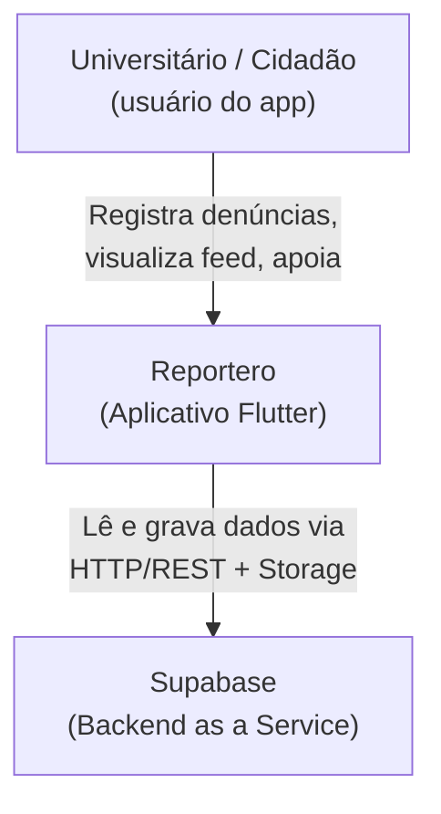
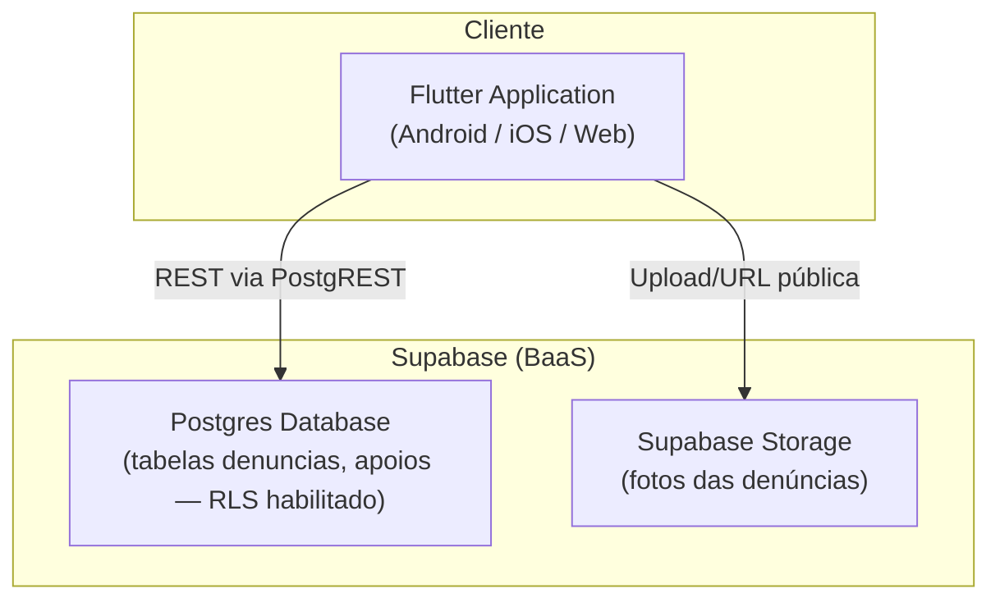
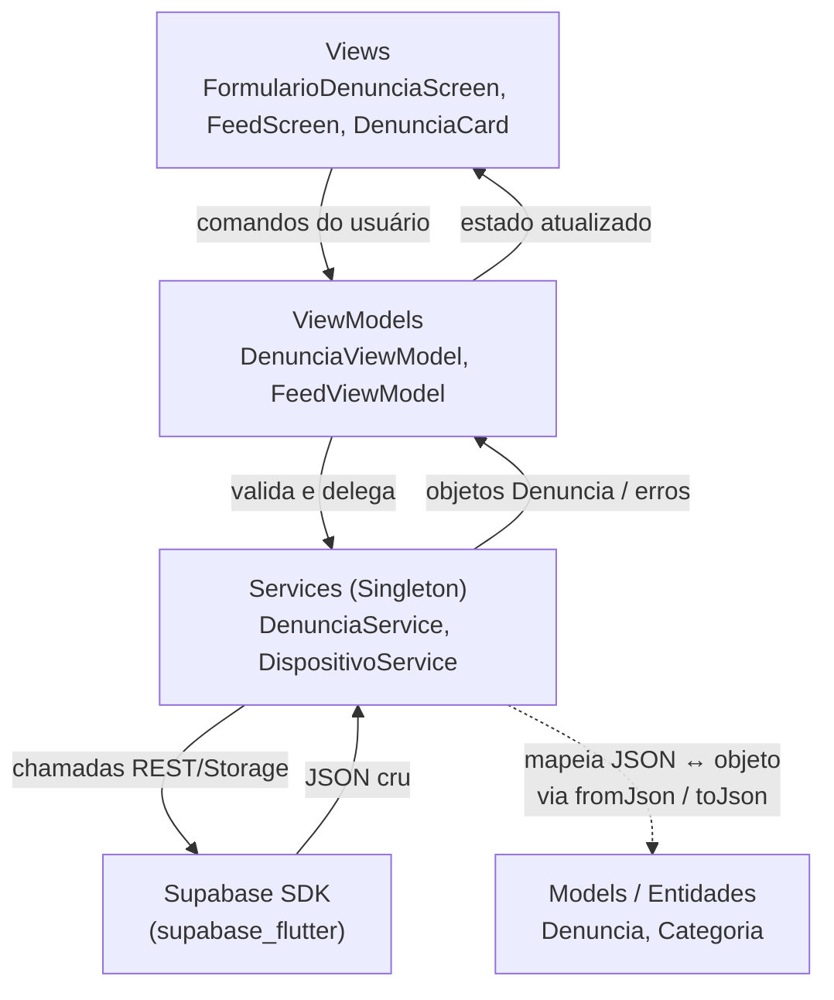

<<<<<<< HEAD
# Reportero
Projeto conduzido durante a disciplina de Engenharia de Software. Professor: Breno Bernard Nicolau de França, IC-UNICAMP.

Aplicaremos na prática os conceitos aprendidos em aula, incluindo modelagem, implementação e documentação de software. 

## Tema
Um app para que alunos e funcionários registrem problemas no campus de forma simples e rápida. Pelo celular, a pessoa pode tirar uma foto, adicionar a localização e enviar ocorrências como falhas de infraestrutura, segurança ou serviços — por exemplo poste caído, árvore danificada, banco quebrado, lâmpada queimada, acidente ou carro estacionado irregularmente. A proposta é centralizar essas reclamações em uma plataforma geolocalizada, com acompanhamento em tempo real, ajudando a universidade a identificar problemas que muitas vezes passam despercebidos e a responder com mais eficiência

## Arquitetura

### Estilo Arquitetural Adotado

- **No Cliente (Frontend):** padrão **MVVM + Services** com Flutter. O clássico MVVM (Model-View-ViewModel) é complementado por uma camada explícita de **Services**, que concentra o acesso a dados e as regras de negócio. A separação é estrita entre quatro responsabilidades:
    - **View** (`lib/views/`): a interface de usuário.
    - **ViewModel** (`lib/viewmodels/`): a lógica de estado e validação, que faz a ponte entre a View e os Services.
    - **Model / Entidades** (`lib/models/`): as entidades de dados (`Denuncia`, `Categoria`), que sabem apenas se traduzir de/para o formato do banco (`fromJson`/`toJson`) e não acessam rede.
    - **Services** (`lib/services/`): `DenunciaService` e `DispositivoService`, que encapsulam o acesso ao Supabase e as regras de negócio (buscar, enviar, apoiar, gerar o id de dispositivo). Operam sobre as entidades e conversam com o mundo externo.
- **No Sistema Geral:** arquitetura **Cliente-Servidor (Serverless / BaaS)**. O aplicativo Flutter consome o **Supabase** diretamente via requisições HTTP/REST (PostgREST) para o banco e via Supabase Storage para upload de fotos — não há servidor de aplicação intermediário.
- **Identidade e anonimato:** o projeto não usa Supabase Auth. Cada denúncia é opcionalmente anônima, e os apoios (upvotes) são vinculados a um identificador de dispositivo gerado e persistido localmente (`DispositivoService`), preservando o anonimato do usuário no feed.
- **Padrão de Projeto (Singleton):** `DenunciaService` e `DispositivoService` implementam Singleton (construtor privado + instância estática via `factory`), garantindo uma única instância de acesso ao cliente Supabase e ao identificador de dispositivo, evitando conexões redundantes e inconsistência de estado entre telas.

### Diagramas C4

#### Nível 1 — Contexto



#### Nível 2 — Contêiner



#### Nível 3 — Componentes (dentro do Flutter Application)



## Testes

O projeto segue a pirâmide de testes: testes de unidade na base, testes de widget no meio e testes de integração no topo.

### Pré-requisitos

- [Flutter](https://docs.flutter.dev/get-started/install) (stable)
- [Docker](https://docs.docker.com/get-docker/) — apenas para testes de integração
- [Supabase CLI](https://supabase.com/docs/guides/cli/getting-started) — apenas para testes de integração

### Testes de unidade e widget

Não exigem nenhuma infraestrutura além do Flutter:

```bash
cd app
flutter test test/models test/viewmodels test/services test/widget_test.dart
```

### Testes de integração

Requerem o Supabase rodando localmente via Docker. Execute na raiz do repositório:

```bash
supabase start                    # sobe PostgreSQL + PostgREST em Docker
                                  # as migrations são aplicadas automaticamente
cd app
flutter test test/integration     # roda os testes contra o banco local
cd ..
supabase stop                     # derruba os containers
```

### Todos os testes de uma vez (sem integração)

```bash
cd app
flutter test
```

### CI

O pipeline roda automaticamente no GitHub Actions a cada push ou pull request. Acesse a aba **Actions** no repositório para acompanhar as execuções.
=======
# app

A new Flutter project.

## Getting Started

This project is a starting point for a Flutter application.

A few resources to get you started if this is your first Flutter project:

- [Learn Flutter](https://docs.flutter.dev/get-started/learn-flutter)
- [Write your first Flutter app](https://docs.flutter.dev/get-started/codelab)
- [Flutter learning resources](https://docs.flutter.dev/reference/learning-resources)

For help getting started with Flutter development, view the
[online documentation](https://docs.flutter.dev/), which offers tutorials,
samples, guidance on mobile development, and a full API reference.
>>>>>>> 486b3f5 (feat: Epico 6 complete)
